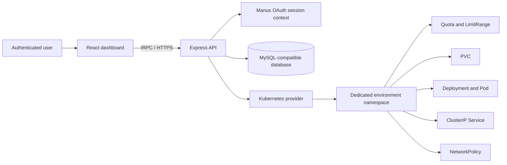
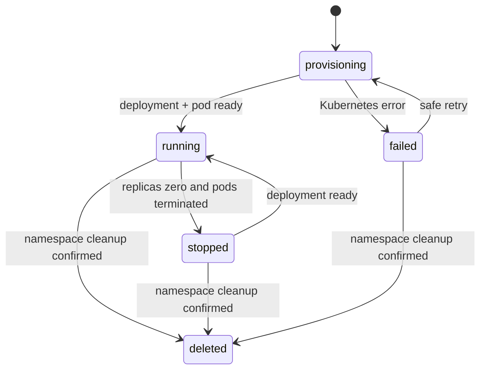

# CNAD32 Architecture

CNAD32 is a modular monolith. The browser interacts with typed tRPC procedures; the server owns authorization, lifecycle transitions, persistence, and Kubernetes calls. Workloads never receive cluster credentials, host mounts, or the platform controller service account.

| Layer                          | Responsibility                                                                                           |
| ------------------------------ | -------------------------------------------------------------------------------------------------------- |
| `client/src`                   | Protected dark dashboard, creation flow, lifecycle controls, logs, events, metrics, and admin monitoring |
| `server/routers`               | Typed API contracts, user/admin authorization, validation, and safe error conversion                     |
| `server/environment-domain.ts` | Quantity validation, source safety, deterministic resource names, and transition rules                   |
| `server/kubernetes.ts`         | Real resource creation, scale operations, restart patches, logs, health, metrics, events, and cleanup    |
| `server/db.ts`                 | Drizzle query helpers and template seeding                                                               |
| `drizzle/schema.ts`            | Users, templates, environments, environment events, and audit logs                                       |

## Lifecycle

The platform persists a lifecycle state only after its own action is accepted or Kubernetes confirms the observed terminal condition.

The `failed` state is an exception path, not a client-controlled lifecycle value. Requests cannot write status fields directly.
